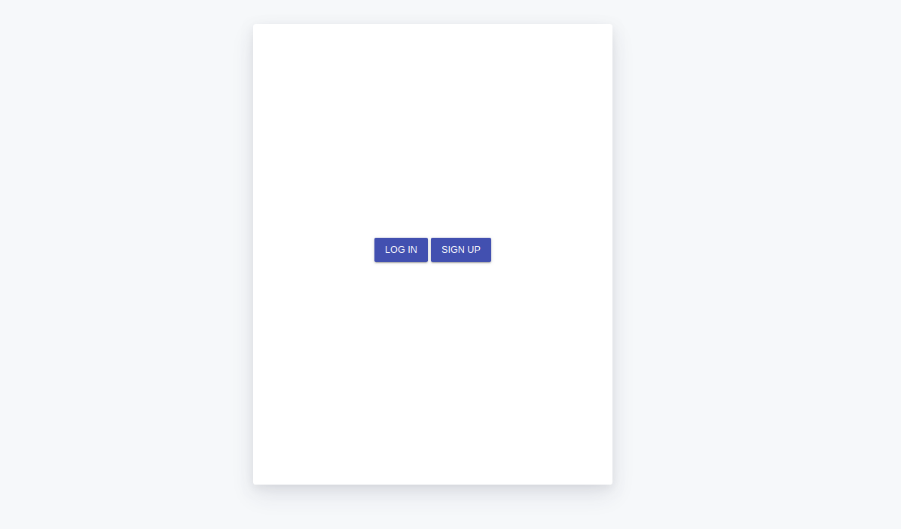
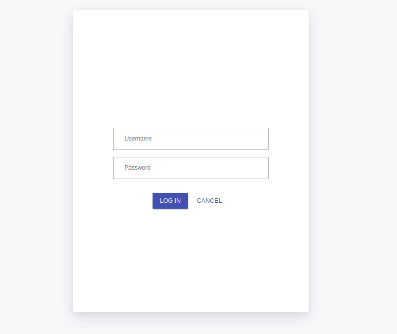
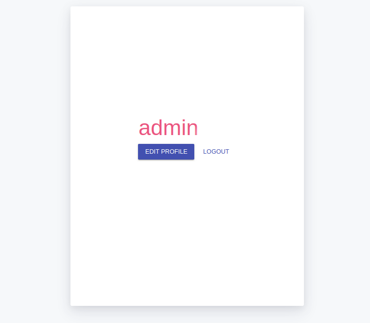
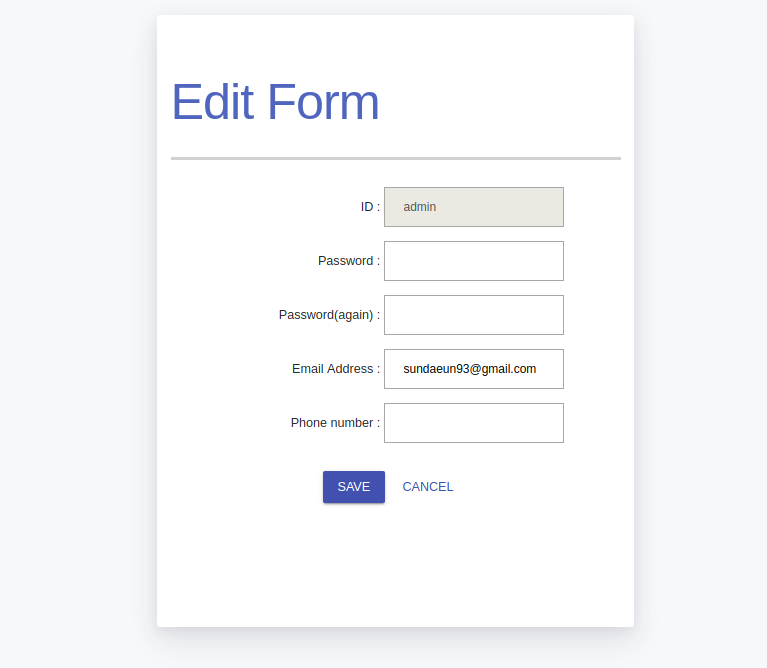
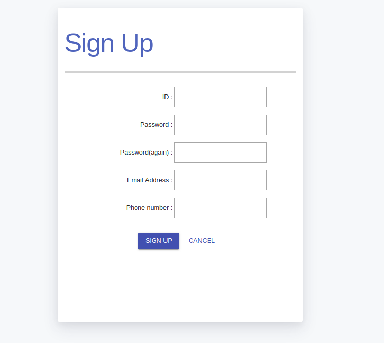

# django-login-example
django login page example


### Development Environment
- OS : Ubuntu
- Language : Python 3.6
- Framework : Django 2.2.2
- DB : Sqlite3
- Front-UI : Material.js


#### 1. Github get source from
MojtabaBakh's github : <https://github.com/MojtabaBakh/Django-login-sample>


```bash
$ git clone https://github.com/MojtabaBakh/Django-login-sample
```


#### 2. Initialize and start the server


```bash
# reset
bash ./django-login-example/bin/init_app.sh
# start
bash ./django-login-example/bin/run_app.sh
```

#### [reference]
##### init_app.sh sauce

```bash
# Move to parent directory
SCRIPT_DIR=$( cd "$( dirname "${BASH_SOURCE[0]}" )" && pwd )
cd $SCRIPT_DIR
cd ..

# Virtual environment creation and entry (server initial setting)
virtualenv --python=python3.6 myvenv

# install django
pip install django~=2.0

# DB initialization
python manage.py migrate

# running web server
python manage.py runserver
```

##### run_app.sh Source (server running)

```bash
# Move to parent directory
SCRIPT_DIR=$( cd "$( dirname "${BASH_SOURCE[0]}" )" && pwd )
cd $SCRIPT_DIR
cd ..

# Enter the virtual environment
source myvenv/bin/activate

# DB initialization
python manage.py migrate

# running web server
python manage.py runserver
```


##### screenshot
main
-----



login page
-----



login page (logined)
-----



edit page
-----



sign up page
-----
 
